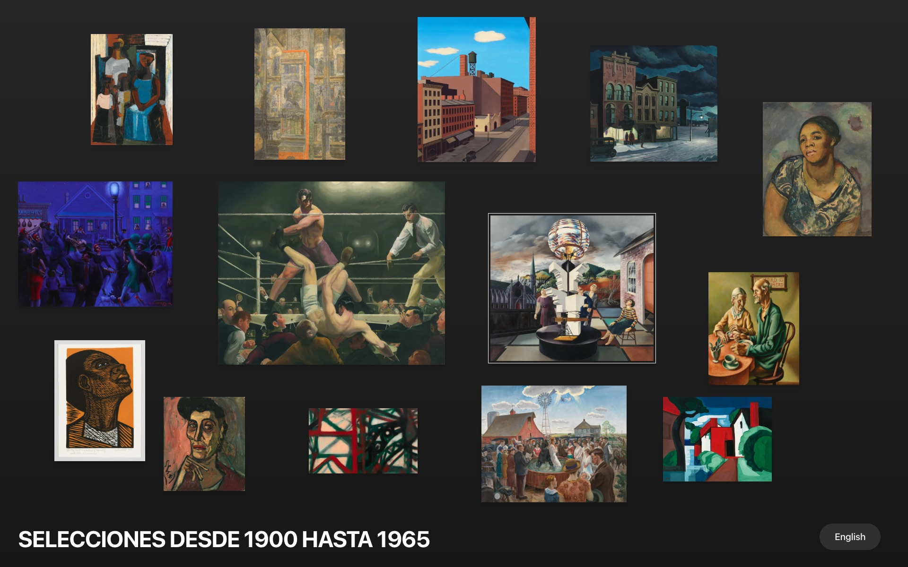
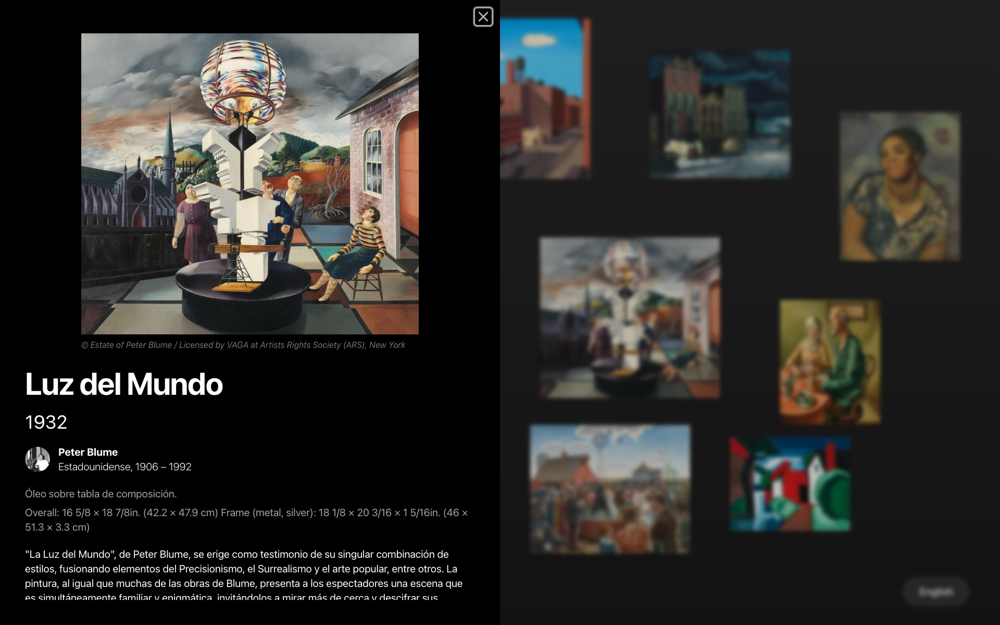
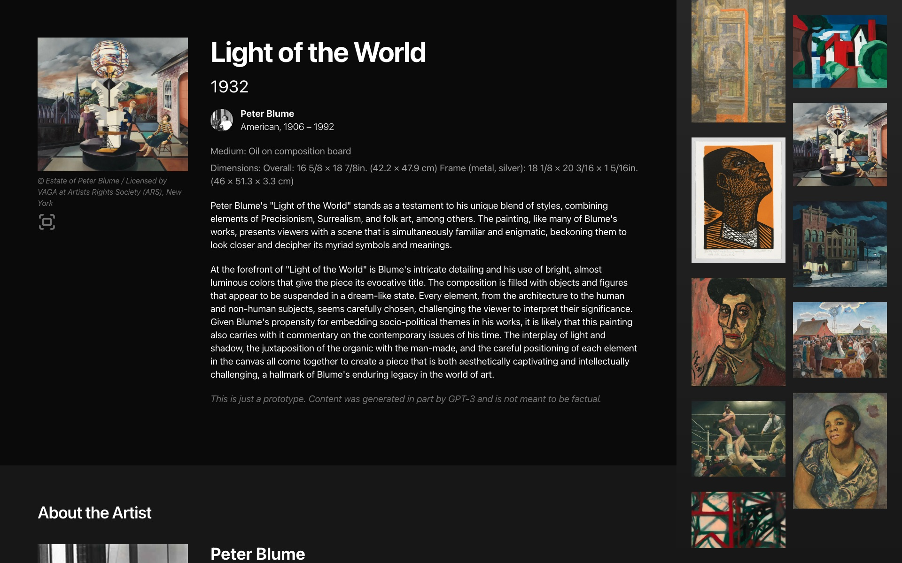

# A statically generated interactive gallery using Next.js and Sanity

This example showcases an image gallery using Next.js's [Static Exports](https://nextjs.org/docs/pages/building-your-application/deploying/static-exports) feature using [Sanity](https://www.sanity.io/) as the data source.

Originally based on [Blog Starter Kit with Sanity](https://vercel.com/templates/next.js/blog-next-sanity).

## Demo

### ["Wall" View](https://collections-interactive-sanity-jl44pfaf9-derekphilipau.vercel.app/wall)

### [Traditional thumbnail View](https://collections-interactive-sanity-jl44pfaf9-derekphilipau.vercel.app)

# Why

An exhibition designer may come across situations for which traditional in-gallery labels or space are insufficient. The Whitney's Collection installation uses graphic label guides to help visitors find objects, while MoMA's Page Turners showcase additional exhibition material.

This prototype demonstrates how one could use a CMS (in this case, Sanity) with Next.js to statically generate a web-based interactive gallery experience. The static build files could then be deployed to an in-gallery touchscreen display such as an iPad in kiosk mode. Note: This project still needs work, for example images need to be locally served.

This is a prototype and not a design proposal, more work would be needed to make this viable and accessible.

This is not a suggestion that in-gallery interactive touchscreens are a good idea. The Whitney's Collection installation is a great example of how to use graphic label guides to help visitors find objects.

[Installation view of The Whitney’s Collection: Selections from 1900 to 1965](https://whitney.org/exhibitions/collection-1900-to-1965)


[MoMA In-Gallery Page Turners](https://eric.young.li/moma-page-turners/) by [Eric Li](https://eric.young.li/)


# Configuration

## Step 1. Run Next.js locally in development mode

```bash
npm install && npm run dev
```

```bash
yarn install && yarn dev
```

Your gallery should be up and running on [http://localhost:3000](http://localhost:3000)!

Note: This also installs dependencies for Sanity Studio as a post-install step.

## Step 2. Set up the environment

```bash
npx vercel link
```

Download the environment variables needed to connect Next.js and Studio to your Sanity project:

```bash
npx vercel env pull
```

Build the project:

```bash
npx vercel build
```

Deploy the prebuilt project:

```bash
npx vercel deploy --prebuilt
```

# Screenshots

Screenshot of "Wall" gallery:





Screenshot of the interactive gallery:



Screenshot of the Sanity Studio, editing an Artwork:


